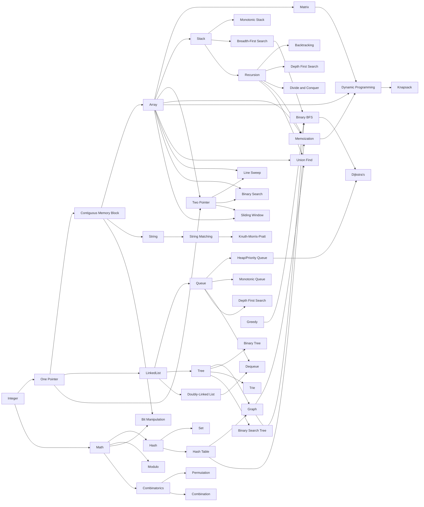

# leetcode knowledge graph

```mermaid
graph LR
    Integer --> Pointer[One Pointer]
    Integer --> Math

    Pointer[One Pointer] --> Sequence
    Pointer --> LinkedList
    Pointer --> TwoPointer[Two Pointer] 

    Sequence[Contiguous Memory Block] --> Array
    Sequence --> String
    Sequence --> BitManip[Bit Manipulation]

    Array --> Matrix
    Array --> Stack
    Array --> TwoPointer[Two Pointer]
    Stack --> MonoStack[Monotonic Stack]
    Stack --> BFS[Breadth-First Search]

    Math --> Hash
    Math --> Modulo
    Math --> BitManip
    Math --> Combinatorics
    Combinatorics --> Permutation
    Combinatorics --> Combination

    Hash --> Set
    Hash --> HashTable[Hash Table]

    Stack --> Recursion
    Recursion --> Backtracking
    Recursion --> DepthFirstSearch[Depth First Search]
    Recursion --> DivideConquer[Divide and Conquer]

    HashTable --> Graph

    %% memoization
    Recursion --> Memoization
    HashTable --> Memoization
    Array --> Memoization

    %% dynamic programming
    Memoization --> DP[Dynamic Programming]
    Array --> DP
    Matrix --> DP   
    DP --> Knapsack

    %% tree
    Tree --> Graph
    Tree --> BinaryTree[Binary Tree]
    Tree --> Trie

    %% union find
    Array --> UnionFind[Union Find]
    Recursion --> UnionFind
    Graph --> UnionFind

    LinkedList --> Queue
    LinkedList --> Tree
    Queue --> Heap[Heap/Priority Queue]
    Queue --> MonoQueue[Monotonic Queue]
    Queue --> Dequeue
    LinkedList --> DoublyLinkedList[Doubly-Linked List]
    DoublyLinkedList --> Dequeue
    Queue --> DFS[Depth First Search]

    
    %% Matrix --> Graph %% some graph algorithms use a matrix to represent the graph
    
    %% line sweep
    TwoPointer --> LineSweep[Line Sweep]
    Array --> LineSweep

    %% binary search
    TwoPointer --> BinarySearch[Binary Search]
    Array --> BinarySearch

    %% binary search tree
    Tree --> BinarySearchTree[Binary Search Tree]
    

    %% sliding window
    Array --> SlidingWindow[Sliding Window]
    TwoPointer --> SlidingWindow


    %% 0-1 bfs
    Graph --> BinaryBFS[Binary BFS]
    BFS --> BinaryBFS
    Greedy --> BinaryBFS
    
    %% dijkstra's algorithm
    Heap --> Dijkstra[Dijkstra's]
    BinaryBFS --> Dijkstra

    %% Knuth-Morris-Pratt algorithm
    String --> StringMatching[String Matching]
    StringMatching --> KMP[Knuth-Morris-Pratt]

```
